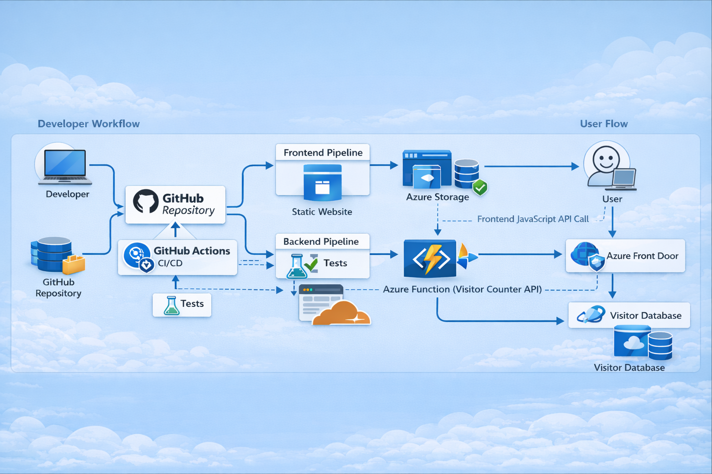
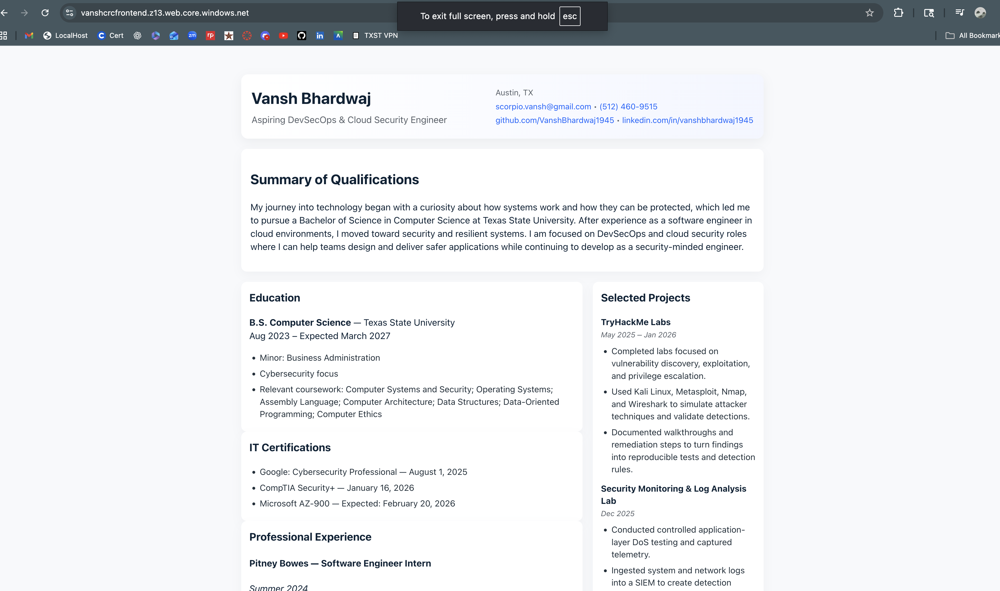
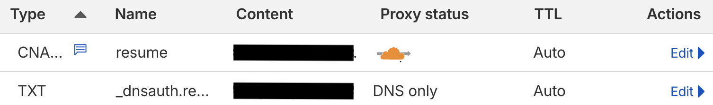
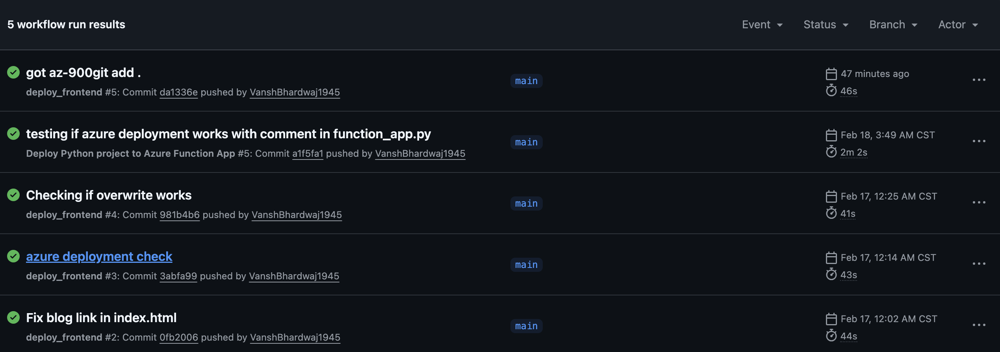

# Cloud Resume Challenge — Azure

<div style="display:flex; justify-content:center;">
  
</div>

## Table of Contents

1. [Overview](#overview)
2. [What is the Cloud Resume Challenge?](#what-is-the-cloud-resume-challenge)
3. [Tech Stack and Tools](#tech-stack-and-tools)
4. [Frontend](#frontend)
   - [HTML](#html)
   - [CSS](#css)
5. [Static Website and Front Door CDN Setup](#static-website-and-front-door-cdn-setup)
   - [Deploying the Static Website](#deploying-the-static-website)
   - [Configuring Azure Front Door](#configuring-azure-front-door)
6. [Custom Domain, HTTPS, and Cloudflare DNS Setup](#custom-domain-https-and-cloudflare-dns-setup)
7. [Visitor Counter — API and Database](#visitor-counter--api-and-database)
   - [Creating the Database (Cosmos DB)](#creating-the-database-cosmos-db)
   - [Creating and Deploying the Azure Function API](#creating-and-deploying-the-azure-function-api)
     - [Creating the Function Project](#creating-the-function-project)
     - [Testing Locally](#testing-locally)
     - [Deploying to Azure](#deploying-to-azure)
   - [Connecting the Frontend](#connecting-the-frontend)
8. [CI/CD Workflow](#cicd-workflow)
   - [Frontend Workflow](#frontend-workflow)
   - [Unit Testing](#unit-testing)
   - [Backend Workflow](#backend-workflow)
9. [Infrastructure as Code with Terraform](#infrastructure-as-code-with-terraform)
   - [Why Terraform](#why-terraform)
   - [Project Structure](#project-structure)
   - [Resources Managed](#resources-managed)
   - [Importing Existing Infrastructure](#importing-existing-infrastructure)
   - [Secrets and Variable Management](#secrets-and-variable-management)
10. [Next Steps](#next-steps)

---

## Overview

This project is my personal cloud-hosted resume — a static website served globally via Azure Front Door, backed by a small serverless API that tracks visitor counts. The goal was to learn real-world cloud deployment while keeping everything automated, version-controlled, and secure.

**Live site:** [https://resume.vanshbhardwaj.com](https://resume.vanshbhardwaj.com)

**Skills demonstrated:**

- Frontend development with HTML, CSS, and JavaScript
- Static site hosting on Azure Storage
- Global content delivery via Azure Front Door
- Custom domain setup with HTTPS and Cloudflare DNS
- Serverless API with Azure Functions
- NoSQL database with Azure Cosmos DB
- CI/CD automation with GitHub Actions
- Infrastructure as Code with Terraform

---

## What is the Cloud Resume Challenge?

The Cloud Resume Challenge is a hands-on project that teaches the fundamentals of deploying a real cloud application — a static resume site served from the edge, plus a small backend for a visitor counter. It covers hosting, DNS, HTTPS, serverless APIs, and automated deployments; all the parts that matter in real-world cloud work.

**Official challenge:** [cloudresumechallenge.dev](https://cloudresumechallenge.dev/docs/the-challenge/azure/)

I followed the Azure variant and extended it beyond the base requirements — adding Azure Front Door, Cloudflare DNS with DNSSEC, a Python Azure Function, GitHub Actions CI/CD, and full Terraform IaC. The goal wasn't just to complete the checklist, but to build something small and realistic that I could iterate on and show to employers.

---

## Tech Stack and Tools

| Tool / Technology | Purpose |
|---|---|
| HTML | Resume structure and content |
| CSS | Styling and responsive layout |
| JavaScript | Frontend logic and API calls |
| Python 3.11 | Backend API language |
| pytest | Unit testing for the Azure Function |
| Azure Storage (Static Website) | Frontend file hosting |
| Azure Front Door | Global routing, CDN, and HTTPS termination |
| Azure Cosmos DB | Persistent visitor count storage |
| Azure Functions (Flex Consumption) | Serverless HTTP API |
| Azure Functions Core Tools | Local development and testing |
| AFD Managed SSL Certificate | HTTPS for the custom domain |
| Cloudflare | DNS management and DNSSEC |
| Terraform | Infrastructure as Code |
| GitHub Actions | CI/CD automation |
| Git / GitHub | Version control |
| Azure CLI | Resource management and deployment scripting |
| curl | API endpoint testing |

---

## Frontend

The frontend is a simple static resume built with HTML and CSS. It was the starting point of the project — the focus at this stage was getting something deployed to Azure rather than building a polished UI. JavaScript was added later when connecting to the Azure Function API.

### HTML

- Created `index.html` with sections for experience, education, and skills

**Source:** [`frontend/index.html`](./frontend/index.html)

### CSS

- Created `style.css` for layout, typography, and responsive design
- Linked stylesheet to `index.html`

**Source:** [`frontend/style.css`](./frontend/style.css)

<figure>
  
  <figcaption>Preview of the static website</figcaption>
</figure>

---

## Static Website and Front Door CDN Setup

### Deploying the Static Website

**Steps taken:**
1. Created an Azure Storage account
2. Enabled static website hosting
3. Uploaded `index.html` and `style.css`
4. Verified the storage static endpoint was accessible

### Configuring Azure Front Door

The challenge originally suggested using Azure CDN, but as of late 2025 that has been superseded by Azure Front Door. Front Door provides everything a CDN offers — edge caching, global routing, HTTPS — plus advanced routing rules, health probes, and higher availability across regions.

**Steps taken:**
1. Created an Azure Front Door profile (Standard tier)
2. Added the Azure Storage static website as an origin
3. Created an origin group with a health probe
4. Configured a routing rule to forward traffic to the origin group
5. Enabled HTTPS-only traffic

> *Getting Front Door routing working correctly took trial and error. Understanding how endpoints, origin groups, and routing rules interact wasn't obvious at first. After testing different configurations and reviewing the documentation, traffic was routing correctly with HTTPS enforced end-to-end.*

---

## Custom Domain, HTTPS, and Cloudflare DNS Setup

The challenge recommends using Azure's built-in domain management, but I chose Cloudflare for DNS. This allowed me to enable DNSSEC — which protects against DNS spoofing and man-in-the-middle attacks — something that isn't straightforward with Azure DNS alone.

**Steps taken:**
1. Purchased a custom domain through Cloudflare
2. Added the custom domain in Azure Front Door
3. Added the TXT record in Cloudflare for AFD domain ownership verification
4. Configured a CNAME record pointing `resume.vanshbhardwaj.com` to the Front Door endpoint
5. Verified domain ownership in the Azure portal
6. Confirmed HTTPS was active via the AFD-managed SSL certificate
7. Enabled DNSSEC on the Cloudflare zone

<figure>
  
</figure>

> *The CNAME record initially had Cloudflare's proxy enabled, which blocked Azure Front Door from validating the domain. Setting it to DNS-only mode resolved the issue. The TXT verification record is unaffected by the proxy setting, so that part was straightforward.*

---

## Visitor Counter — API and Database

This section introduces backend integration: the site fetches and displays a visitor count stored in a database. The architecture deliberately keeps the database behind an API layer — the frontend never communicates with Cosmos DB directly.

**Architecture:**
```
Frontend (JavaScript) → Azure Function API → Cosmos DB
```

This keeps credentials secure, enforces controlled access to data, and mirrors how real-world cloud applications are structured.

### Creating the Database (Cosmos DB)

A serverless Cosmos DB account was used to store the visitor count as a single document. Serverless billing means no minimum cost — the database only charges per request, which is appropriate for low-traffic use.

| Setting | Value |
|---|---|
| Database | `counter` |
| Container | `visitorcount` |
| Partition key | `/id` |

**Document structure:**
```json
{
  "id": "counter",
  "count": 36
}
```

Each API call reads this document, increments `count` by 1, writes it back, and returns the updated value.

### Creating and Deploying the Azure Function API

A Python Azure Function with an HTTP trigger handles all database operations. This keeps the Cosmos DB connection string server-side and out of the browser.

### Creating the Function Project

**Source:** [`backend/api/function_app.py`](./backend/api/function_app.py)

**Steps taken:**
1. Initialised a new Azure Function project in `backend/api/` using the HTTP trigger template
2. Added the Cosmos DB connection string to `local.settings.json` for local development
3. Implemented `function_app.py` to:
   - Connect to Cosmos DB using the connection string from application settings
   - Read the current visitor count document
   - Increment the count by 1
   - Write the updated document back to the database
   - Return the new count as JSON
4. Confirmed `local.settings.json` and `.venv/` were excluded via `.gitignore`

> *The `azure.functions` decorator pattern was new to me — I had used Python extensively before but never in an Azure Functions context. Understanding how HTTP triggers, bindings, and the function runtime fit together required a shift in thinking. Microsoft's official documentation was the primary reference, supplemented by additional research to understand the request and response object structures.*

### Testing Locally

**Steps taken:**
1. Started the function locally:
```bash
func host start
```
2. Verified the function:
   - Incremented the visitor count in Cosmos DB
   - Returned a valid JSON response: `{ "count": 37 }`
   - Ran without exceptions

### Deploying to Azure

**Steps taken:**
1. Created an Azure Function App (Flex Consumption plan, Python 3.11, Linux)
2. Added the Cosmos DB connection string as an Application Setting
3. Deployed the function to the Function App
4. Configured CORS to allow requests from the frontend:
   - Allowed origins: `https://resume.vanshbhardwaj.com` and `https://crcfrontendra.z19.web.core.windows.net`
   - Enabled `Access-Control-Allow-Credentials`
5. Verified the deployed function responded correctly to HTTP requests

### Connecting the Frontend

**Source:** [`frontend/script.js`](./frontend/script.js)

**Steps taken:**
1. Added a `<span id="counter"></span>` element to `index.html`
2. Added JavaScript in `script.js` to call the API on page load:
```javascript
const counterEl = document.getElementById("counter");
try {
  const res = await fetch(functionAPIURL);
  if (!res.ok) throw new Error(`Function returned ${res.status}`);
  const data = await res.json();
  counterEl.innerText = data.count ?? "0";
} catch (err) {
  console.error("getVisitCount error:", err);
  counterEl.innerText = "—";
}
```
3. Uploaded the updated files to Azure Storage
4. Verified the visitor count loaded correctly on the live site

---

## CI/CD Workflow

Up to this point all deployments were manual. This section introduces GitHub Actions workflows to automate both frontend and backend deployments. A Service Principal was created and its credentials stored as encrypted GitHub Secrets, so the workflows can authenticate with Azure without any hardcoded credentials.

### Frontend Workflow

**Source:** [`.github/workflows/frontend.main.yaml`](.github/workflows/frontend.main.yaml)

On every push to `main` that touches the `frontend/` directory, the workflow uploads the updated static files to Azure Storage automatically.

**Steps taken:**
1. Created a Service Principal with the Contributor role:
```bash
az ad sp create-for-rbac \
  --name "AzureResumeACG" \
  --role contributor \
  --scopes /subscriptions/YOUR_SUBSCRIPTION_ID \
  --sdk-auth
```
2. Stored the credentials as an encrypted GitHub Secret (`AZURE_CREDENTIALS`)
3. Created `.github/workflows/frontend.main.yaml` based on the Microsoft GitHub Actions template
4. Pushed to `main` to trigger the workflow

> *The Microsoft template failed on first run with a `BlobAlreadyExists` error — the `az storage blob upload-batch` command needed the `--overwrite` flag. After that fix, deployments ran cleanly on every push.*

### Unit Testing

Before automating deployment, the Azure Function's core logic needed to be testable without touching the production database. This required mocking — simulating Cosmos DB responses so tests could run safely in any environment.

**Source:** [`backend/tests/test_function_app.py`](backend/tests/test_function_app.py)

**Steps taken:**
1. Created `backend/tests/` with `__init__.py` to make it a Python package
2. Configured a `.venv` virtual environment inside `backend/api/` to isolate dependencies
3. Added `pytest` to `requirements.txt`
4. Wrote test cases that mock the Azure Cosmos DB client and the Azure Functions HTTP request/response objects
5. Verified all tests passed locally:
```bash
source backend/api/.venv/bin/activate
python -m pytest backend/tests -v
```

> *Mocking was the hardest part of the entire project. The Azure SDK has many internal objects that need to be mocked at the right level, and the documentation doesn't make this obvious. After working through it — with some AI assistance to identify the correct mock targets — tests passed cleanly. It was a significant moment that underlined why testable architecture matters.*

### Backend Workflow

**Source:** [`.github/workflows/backend.main.yaml`](.github/workflows/backend.main.yaml)

On every push to `main` that touches the `backend/` directory, the workflow runs unit tests first and only deploys if they pass.

**Steps taken:**
1. Created `.github/workflows/backend.main.yaml`
2. Added a test step to run before any deployment:
```yaml
- name: Run Unit Tests
  shell: bash
  run: |
    cd backend/api
    python -m venv .venv
    source .venv/bin/activate
    pip install --upgrade pip
    pip install -r requirements.txt
    cd ..
    python -m pytest tests -v
```
3. Added Azure login using the Service Principal secret:
```yaml
- name: Login via Azure CLI
  uses: azure/login@v2
  with:
    creds: ${{ secrets.AZURE_CREDENTIALS }}
```
4. Added a deployment step using the Azure CLI:
```yaml
- name: Deploy to Azure Functions
  shell: bash
  run: |
    cd ./backend/api
    zip -r /tmp/function.zip . \
      --exclude ".venv/*" \
      --exclude "__pycache__/*" \
      --exclude "*.pyc"
    az functionapp deployment source config-zip \
      --name page-counter \
      --resource-group crc-backend-rg \
      --src /tmp/function.zip
```

> *The original workflow used `Azure/functions-action@v1`, which does not correctly detect the Python runtime on a Flex Consumption plan — it treated the app as a V1 function and overwrote the runtime configuration on every deploy. Switching to `az functionapp deployment source config-zip` — the correct deployment method for Flex Consumption — resolved the issue permanently.*

<figure>
  
  <figcaption>Successful workflow runs in GitHub Actions</figcaption>
</figure>

---

## Infrastructure as Code with Terraform

After building the project manually through the Azure Portal, all infrastructure was codified using Terraform. Every resource — Azure and Cloudflare — is now declared in version-controlled `.tf` files, giving a complete, auditable, and reproducible picture of the environment.

**Source:** [`infra/terraform/`](./infra/terraform/)

### Why Terraform

Clicking through the portal is fine for learning, but it leaves no record of how things were configured and makes it difficult to reproduce or audit the setup. Terraform solves this by declaring infrastructure in code that can be committed to Git, reviewed like any other change, and applied consistently. It also forces a deeper understanding of each resource — you have to know what every argument does rather than accepting portal defaults.

### Project Structure

The configuration is split into logical files rather than one large `main.tf`:

```
infra/terraform/
├── main.tf              # Provider configuration
├── resource_groups.tf   # Frontend and backend resource groups
├── frontend.tf          # Storage account, Front Door, origin, route, custom domain
├── backend.tf           # Cosmos DB, Function App, App Service Plan, storage
├── dns.tf               # Cloudflare DNS records and DNSSEC
├── variables.tf         # Input variable declarations
└── terraform.tfvars     # Secret values — gitignored, never committed
```

### Resources Managed

All infrastructure is managed across two Terraform providers:

**Azure (`hashicorp/azurerm` ~> 4.21):**

| Resource Type | Name |
|---|---|
| Resource Groups | `crc-frontend-rg`, `crc-backend-rg` |
| Storage Account (frontend) | `crcfrontendra` |
| Front Door Profile | `crc-resume-fd` |
| Front Door Origin Group | `resume-origin-group` |
| Front Door Origin | `crcfrontendra-staticwebsite` |
| Front Door Endpoint | `crc-vansh-resume` |
| Front Door Route | `frontendra-fd-route` |
| Front Door Custom Domain | `resume-vanshbhardwaj-com-4f0a` |
| Cosmos DB Account | `crc-visitor-counter` |
| Cosmos DB Database | `counter` |
| Cosmos DB Container | `visitorcount` |
| Storage Account (backend) | `crcbackendrg9af7` |
| Storage Container (deployments) | `app-package-page-counter-52f547a` |
| App Service Plan | `ASP-crcbackendrg-9747` (Flex Consumption) |
| Function App | `page-counter` (Python 3.11) |

**Cloudflare (`cloudflare/cloudflare` ~> 5):**

| Resource Type | Purpose |
|---|---|
| TXT record (`_dnsauth.resume`) | Azure Front Door domain ownership verification |
| CNAME record (`resume`) | Points `resume.vanshbhardwaj.com` to the Front Door endpoint |
| Zone DNSSEC | Cryptographic protection for the `vanshbhardwaj.com` zone |

### Importing Existing Infrastructure

Since all resources were originally created through the portal, `terraform import` was used to bring each one into state without recreating anything. This was the most involved part of the process — the Azure provider is strict about resource ID casing, portal defaults often differ from Terraform defaults, and some resources had provider-level bugs that required workarounds.

**Key issues resolved:**

| Issue | Resolution |
|---|---|
| Front Door route name mismatch | Actual name (`frontendra-fd-route`) differed from what the portal showed — discovered by exporting the ARM template |
| `azurerm_cdn_frontdoor_custom_domain_association` import bug | Known provider bug with no fix; worked around by linking the custom domain directly on the route via `cdn_frontdoor_custom_domain_ids` |
| Cosmos DB partition key version | Terraform defaults to version 1; the portal creates version 2 — required explicitly setting `partition_key_version = 2` to avoid a forced destroy and recreate |
| Flex Consumption Function App | Required upgrading the provider from `~> 4.1` to `~> 4.21` to access `azurerm_function_app_flex_consumption` |
| Cloudflare DNS record IDs | Not visible in the Cloudflare dashboard — retrieved via the Cloudflare REST API before importing |

After resolving all drift, `terraform plan` reports no changes.

> *Importing existing infrastructure is significantly harder than writing Terraform for new resources. The import process exposed a lot of invisible configuration — portal defaults, Azure-managed tags, computed attributes, and provider bugs — that simply don't appear when clicking through the UI. Working through each issue one by one gave me a much deeper understanding of how every resource is actually configured under the hood.*

### Secrets and Variable Management

Sensitive values are kept out of source code using Terraform input variables marked as `sensitive`:

```hcl
variable "cosmosdb_connection_string" {
  type      = string
  sensitive = true
}

variable "app_insights_connection_string" {
  type      = string
  sensitive = true
}
```

Values are stored locally in `terraform.tfvars`, which is excluded from version control via `.gitignore`. The Cloudflare API token is passed through the `CLOUDFLARE_API_TOKEN` environment variable and never written to any file.

---

## Next Steps

- [ ] Add Application Insights resource to Terraform
- [ ] Add resume PDF download option
- [ ] Harden Azure RBAC — apply least privilege to the Service Principal
- [ ] Secure CI/CD pipeline: signed commits, dependency scanning, CodeQL, SBOM
- [ ] Add a plan-only Terraform workflow to validate infrastructure changes on PRs
- [ ] Add staging environment with PR deployments and smoke tests
- [ ] Implement monitoring and alerting with Application Insights and Azure Monitor
